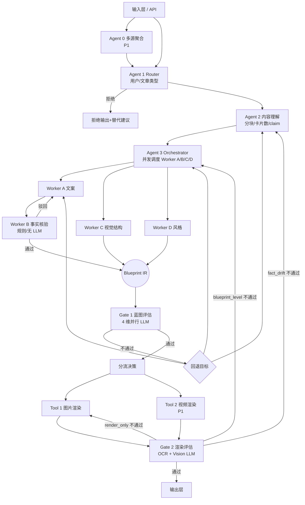

# 长文转信息图/视频 - 技术设计方案

> 版本：v3.0（草案）
> 日期：2026-04-28
> 对应 PRD：`product_prd`、`product_prd_workflow.png`

---

## 0. 关键技术决策摘要

| 决策项 | 选择 | 原因 |
|---|---|---|
| 后端语言 | Python 3.11+ | 多 Agent 编排生态成熟，LLM SDK / NLP / Playwright 均原生支持 |
| 服务框架 | FastAPI（HTTP + WebSocket） | 异步原生、OpenAPI 自动生成、易于 Agent 流式回包 |
| 编排层 | LangGraph + 自研轻量 Orchestrator | LangGraph 提供有状态 DAG/重试，Orchestrator 处理 Worker 并行+回退策略 |
| 主力 LLM | Claude Sonnet 4.x | 中文理解强、长上下文（200k）满足整篇原文+Blueprint 输入；事实忠实度高契合 Worker A/Gate 1 |
| Embedding | `bge-m3`（本地）/ `text-embedding-3-large`（云） | 用于 Agent 0 语义去重；MVP 优先本地化避免成本 |
| 渲染引擎 | Playwright（headless Chromium）+ HTML/CSS 模板 | 中文 100% 准确、像素级可控、与设计 token 解耦 |
| TTS（P1） | 火山引擎 TTS / Azure TTS | 国内中文音色丰富、稳定性好 |
| 对象存储 | S3 兼容（MinIO 自托管 / 阿里云 OSS） | Blueprint、渲染产物、缓存统一寻址 |
| 元数据存储 | PostgreSQL + Redis | PG 存 Blueprint/任务状态，Redis 存缓存与限流 |
| MVP 范围 | **图片** 为主、**全量 5 风格 × 10 结构**、单文档输入 | 多源（Agent 0）、视频（Tool 2）列入 P1 |

---

## 1. 整体设计方案

### 1.1 系统总览

整个 Skill 是一个**有状态、可回退、可观测**的多 Agent 流水线，对外暴露一个"长文进、信息图/视频出"的接口。



### 1.2 分层架构

系统采用**四层架构**：

| 层 | 职责 | 关键组件 |
|---|---|---|
| 接入层 | HTTP API、参数校验、鉴权、限流、任务追踪 | FastAPI、Pydantic、Redis 限流 |
| 编排层 | 流水线状态管理、节点调度、重试预算、事件广播 | LangGraph、自研 Orchestrator、Trace |
| 执行层 | 各 Agent / Worker / Gate / Tool 的纯计算逻辑 | Agent 0~3、Worker A~D、Gate 1/2、Tool 1/2 |
| 资源层 | LLM 调用、向量检索、对象存储、关系存储、TTS、Playwright 池 | LLM Client、Embedding Client、S3、PG、Redis、Playwright Pool |

**关键解耦原则**：
- 执行层模块**无状态**，所有上下文通过参数传入和返回。
- 编排层负责**状态机推进**与**回退路由**，执行层不直接互相调用。
- Worker A/B/C/D **可并行**：A→B 是顺序（A 出文案→B 校验），C/D 与 A 在同一 claim 集合上并行（详见 §3.4）。

### 1.3 数据流与控制流

数据流（自底向上膨胀又收敛）：

```
原文(text)
  → SourceBundle（多源场景为多条）
  → RouterDecision（user_type/article_type/risk）
  → ContentTree（分块 + claim 集合 + 卡片预算）
  → Blueprint（卡片数组，每卡含 content + visual_spec + style_tokens + b_check）
  → RenderArtifact（PNG/MP4 + 缩略图 + render_meta）
```

控制流（每一步都可触发回退）：

```
回退优先级：fact_drift > blueprint_level > render_only
回退目标：fact_drift→Agent 2；blueprint_level→Agent 3；render_only→Tool
全局重试预算：6 次（render_only=3, blueprint=2, fact_drift=1）
```

每个节点都把**状态、输入指针、输出指针**写入 PG，便于断点续跑与人工介入。

### 1.4 部署形态

MVP 单机部署：

```
┌────────────────────────────────────────────┐
│ FastAPI Server (uvicorn, 4 workers)        │
│  ├─ /api/v1/generate (POST)                │
│  ├─ /api/v1/jobs/{id} (GET, 流式 SSE)      │
│  └─ /api/v1/jobs/{id}/artifacts (GET)      │
├────────────────────────────────────────────┤
│ Orchestrator Process (asyncio)             │
│  ├─ LangGraph StateGraph                   │
│  └─ Playwright Pool (3 浏览器实例)         │
├────────────────────────────────────────────┤
│ PostgreSQL (jobs, blueprints, retries)     │
│ Redis (cache, queue, lock)                 │
│ MinIO (artifacts: PNG/MP4/缩略图)          │
└────────────────────────────────────────────┘
```

P1 演进：抽出 Worker / Tool 为独立 worker 池（Celery + Redis Stream），按 Worker 类型分队列以匹配 LLM 限流。

### 1.5 P0 / P1 / P2 路线图

| 优先级 | 范围 |
|---|---|
| P0（MVP） | 单源输入；Agent 1/2/3 + Worker A/B/C/D + Gate 1/2 + Tool 1（图）；全量 5 风格 × 10 结构；小红书 + 朋友圈两个平台变体（共 20 套模板） |
| P1 | Agent 0 多源聚合；Tool 2 视频；公众号 + 通用方图变体；二维码/生成标识；voting 模式默认开启 |
| P2 | 文生视频；用户自定义风格；品牌定制；token/性能优化、多模态前端 |

---

## 2. 接口格式定义

所有内部接口统一使用 **Pydantic Model + JSON**。下文以 Python 类型示意，实际落地为 Pydantic v2 BaseModel。

### 2.1 系统对外接口

#### 2.1.1 创建生成任务 `POST /api/v1/generate`

**请求体**：

```json
{
  "input": {
    "mode": "single | multi",
    "content": "...原文文本...",
    "sources": [
      { "source_id": "s1", "url": "...", "title": "...", "publish_time": "2026-04-20", "authority": "authoritative|mainstream_media|professional_blog|general_web|user_generated", "raw_text": "..." }
    ]
  },
  "user_profile": {
    "user_type": "professional | general | auto",
    "history_summary": null
  },
  "preferences": {
    "target_platform": "xiaohongshu | wechat_moments | wechat_official | weibo | douyin | auto",
    "output_format": "image | video | auto",
    "style_hint": "clean_business | xiaohongshu_warm | data_journalism | tech_minimal | magazine_editorial | auto",
    "watermark": true,
    "qrcode": false
  },
  "trace": { "client_id": "...", "request_id": "..." }
}
```

**响应**（异步任务）：

```json
{ "job_id": "j_2026XXXX", "status": "queued", "stream_url": "/api/v1/jobs/j_2026XXXX/stream" }
```

#### 2.1.2 任务流式状态 `GET /api/v1/jobs/{id}/stream`（SSE）

事件序列举例：

```
event: stage  data: {"stage":"agent1_router","status":"running"}
event: stage  data: {"stage":"agent1_router","status":"done","result":{"article_type":"policy","user_type":"general"}}
event: stage  data: {"stage":"agent2_understanding","status":"running"}
...
event: gate1  data: {"verdict":"pass","scores":{...}}
event: artifact data: {"type":"image","url":"..."}
event: done   data: {"job_id":"j_..."}
```

#### 2.1.3 获取任务产物 `GET /api/v1/jobs/{id}/artifacts`

```json
{
  "job_id": "j_...",
  "status": "succeeded | failed | degraded",
  "degrade_level": null,
  "artifacts": [
    { "platform": "xiaohongshu", "type": "image", "url": "https://...png", "thumbnail_url": "...", "render_meta": {...} }
  ],
  "blueprint_url": "https://.../blueprint.json",
  "telemetry": { "duration_ms": 123456, "retries": {...}, "model_calls": {...} }
}
```

### 2.2 内部数据契约

下面定义贯穿全流水线的核心 IR。所有节点的输入/输出都是这套结构的子集或扩展。

#### 2.2.1 SourceBundle（输入封装，Agent 0 输出 / 单源场景由系统直接构造）

```python
class Source(BaseModel):
    source_id: str
    url: str | None
    title: str | None
    publish_time: datetime | None
    authority: Literal["authoritative","mainstream_media","professional_blog","general_web","user_generated"]
    raw_text: str
    summary_200: str | None  # Agent 0 生成的 200 字摘要（用于去重）
    embedding: list[float] | None  # 缓存的向量

class DuplicateCluster(BaseModel):
    cluster_id: str
    member_source_ids: list[str]
    representative_id: str  # 选定主源

class Disagreement(BaseModel):
    disagreement_id: str
    type: Literal["data","time","factual","perspective","timeliness"]
    description: str
    source_views: list[dict]  # [{source_id, claim_text}]
    resolution: Literal["pick_most_authoritative","pick_latest","preserve_both"]

class SourceBundle(BaseModel):
    bundle_id: str
    mode: Literal["single","multi"]
    sources: list[Source]
    duplicate_clusters: list[DuplicateCluster] = []
    disagreements: list[Disagreement] = []
    multi_source_meta: dict | None = None  # source_count、authority_distribution 等
```

#### 2.2.2 RouterDecision（Agent 1 输出）

```python
class RouterDecision(BaseModel):
    article_type: Literal["multi_result","policy","research","news_event","personal_opinion","other"]
    user_type: Literal["professional","general"]
    risk_level: Literal["low","medium","high","blocked"]
    reject_reason: str | None
    reject_alternative: str | None  # 拒绝时给出的替代方案
    skip_pipeline: bool  # 文长越界等直接跳过
    skip_reason: str | None
    target_platform: str
    output_format_hint: Literal["image","video","auto"]
```

#### 2.2.3 ContentTree（Agent 2 输出）

```python
class TextChunk(BaseModel):
    chunk_id: str
    char_start: int
    char_end: int
    text: str
    section_title: str | None
    overlap_with_prev: int  # 与上一块重叠字数

class EvidenceSpan(BaseModel):
    char_start: int
    char_end: int
    context_50: str  # 前后各 25 字上下文

class Claim(BaseModel):
    claim_id: str
    statement: str  # 原始论点（未压缩）
    importance: int  # 1-5
    chunk_ids: list[str]
    source_refs: list[str]  # 多源场景必填，单源为单元素列表
    evidence_spans: list[EvidenceSpan]
    has_disagreement: bool
    disagreement_refs: list[str] = []
    facts: list["FactElement"] = []

class FactElement(BaseModel):
    fact_id: str
    type: Literal["number","time","person","org","location"]
    raw_value: str
    evidence_span: EvidenceSpan

class CardSlot(BaseModel):
    card_index: int  # 卡片在最终 Blueprint 中的预期位置
    role: Literal["cover","section","detail","conflict","source_list","summary"]
    claim_ids: list[str]  # 这张卡承载哪些 claim
    expected_visual_hint: str | None  # Agent 2 给出的弱建议，最终决定权在 Worker C

class ContentTree(BaseModel):
    tree_id: str
    chunks: list[TextChunk]
    claims: list[Claim]
    card_slots: list[CardSlot]
    narrative_structure_candidates: list[str]  # Agent 2 推荐 1-3 个结构供 Agent 3 选
    info_density: float  # 数据点 / 千字
    estimated_card_count: int
```

#### 2.2.4 Blueprint（Agent 3 + Workers 输出 → Gate 1 输入）

```python
class CardContent(BaseModel):
    card_id: str
    title: str  # ≤18 中文
    body: str   # ≤80 中文
    annotations: list[str] = []  # 数据来源、限定词等

class VisualSpec(BaseModel):
    visual_type: Literal["text_only","text_with_icon","data_highlight","data_chart","timeline","flow_diagram","comparison_table","entity_graph"]
    structured_data: dict  # 视觉类型对应的结构化数据
    emphasis: Literal["highlight_number","highlight_phrase","highlight_node","none"]
    suggested_icons: list[str] = []
    illustration_keywords: list[str] = []  # P1+

class BCheck(BaseModel):
    status: Literal["passed","rejected","alias_used"]
    checked_elements: list[dict]  # 每元素含 type/value/evidence_span/match_method
    rejected_reasons: list[str] = []

class Card(BaseModel):
    card_id: str
    role: str
    title_warning: bool = False  # Worker A 标题党 borderline 标记
    content: CardContent
    visual_spec: VisualSpec
    b_check: BCheck
    claim_ids: list[str]
    source_refs: list[str]

class StyleTokens(BaseModel):
    style_id: str  # clean_business / xiaohongshu_warm / ...
    palette: dict[str, str]  # 10 个配色位
    typography: dict  # font_family / sizes / weights / line_heights
    spacing: dict
    shape: dict
    icon: dict
    chart_palette: dict | None

class Blueprint(BaseModel):
    blueprint_id: str
    job_id: str
    article_type: str
    user_type: str
    narrative_structure: str
    target_platform: str
    output_format: Literal["image","video"]
    cards: list[Card]
    style_tokens: StyleTokens
    multi_source_meta: dict | None = None
    created_at: datetime
```

#### 2.2.5 Gate1Verdict / Gate2Verdict

```python
class Gate1Verdict(BaseModel):
    verdict: Literal["pass","fail"]
    scores: dict  # {info_completeness, semantic_fidelity, card_reasonability, audience_fit}
    failures: list[dict]  # [{dimension, score, fail_reason, fallback_target, fallback_payload}]

class Gate2Issue(BaseModel):
    card_id: str | None
    issue_type: Literal["render_only","blueprint_level","fact_drift"]
    detail: str
    severity: Literal["low","medium","high"]

class Gate2Verdict(BaseModel):
    verdict: Literal["pass","fail"]
    issues: list[Gate2Issue]
    chosen_fallback: dict | None  # {target, retry_counter_snapshot}
```

#### 2.2.6 RenderArtifact（Tool 1 / Tool 2 输出）

```python
class RenderArtifact(BaseModel):
    render_id: str
    blueprint_id: str
    type: Literal["image","video"]
    platform: str
    url: str            # 主产物
    thumbnail_url: str
    width: int
    height: int
    duration_sec: float | None  # 视频
    file_size_bytes: int
    template_id: str
    rendered_at: datetime
    render_duration_ms: int
    cache_hit: bool
```

### 2.3 各模块接口签名（Python 函数式）

> 所有模块以纯函数 + 注入式依赖（LLM client、Embedder、Storage）暴露。下表给出 MVP 形态。

| 模块 | 函数签名 |
|---|---|
| Agent 0 | `async def aggregate(sources: list[Source], deps: Deps) -> SourceBundle` |
| Agent 1 | `async def route(bundle: SourceBundle, profile: UserProfile, deps: Deps) -> RouterDecision` |
| Agent 2 | `async def understand(bundle: SourceBundle, decision: RouterDecision, deps: Deps) -> ContentTree` |
| Agent 3 | `async def orchestrate(tree: ContentTree, decision: RouterDecision, deps: Deps) -> Blueprint` |
| Worker A | `async def write_card(card_slot: CardSlot, claims: list[Claim], decision: RouterDecision, deps: Deps) -> CardContent` |
| Worker B | `def verify_facts(content: CardContent, claims: list[Claim], source_text: str, alias_table: AliasTable) -> BCheck` |
| Worker C | `async def design_visual(card_slot: CardSlot, content: CardContent, claims: list[Claim], deps: Deps) -> VisualSpec` |
| Worker D | `def select_style(decision: RouterDecision, structure: str, platform: str) -> StyleTokens` |
| Gate 1 | `async def evaluate_blueprint(bp: Blueprint, source_text: str, deps: Deps) -> Gate1Verdict` |
| 分流决策 | `def decide_format(bp: Blueprint, decision: RouterDecision) -> Literal["image","video"]` |
| Tool 1 | `async def render_image(bp: Blueprint, options: RenderOptions, deps: Deps) -> list[RenderArtifact]` |
| Tool 2 | `async def render_video(bp: Blueprint, options: RenderOptions, deps: Deps) -> RenderArtifact`（P1） |
| Gate 2 | `async def evaluate_render(artifacts: list[RenderArtifact], bp: Blueprint, deps: Deps) -> Gate2Verdict` |

`Deps` 注入容器：

```python
@dataclass
class Deps:
    llm: LLMClient            # Claude 主调用
    aux_llm: LLMClient        # 辅助/降级模型（如 Haiku）
    embedder: Embedder
    ner: NERClient
    vision_llm: VisionLLM
    ocr: OCRClient
    storage: ObjectStorage
    db: Database
    cache: Cache
    playwright_pool: PlaywrightPool
    tts: TTSClient | None
    config: AppConfig
```

---

## 3. 各模块技术设计

### 3.1 Agent 0 多内容源聚合（P1）

**职责**：把多源原始文本聚合为去重、冲突标注、溯源完整的 `SourceBundle`，供下游统一消费。

**实现要点**：

1. **信源分级**：基于 URL 域名映射表（`authority_map.yaml`）打 authority 标签。未命中域名时调用 LLM 兜底分类（一次 batch 调用，输出 JSON 数组）。
2. **两层去重**：
   - 第一层：每个源做 200 字摘要（Claude Haiku 单次调用 N 个源批量化，prompt 约束严格抽取式）→ 用 `bge-m3` 取 embedding → 计算余弦相似度。相似度 > 0.85 合并 cluster，cluster 内取 authority 最高源为代表，其余源仅保留 source_id 用于溯源。
   - 第二层：放在 Worker A/C 生成 claim 阶段（见 §3.5），不在 Agent 0 实施。
3. **冲突检测**：先 LLM 抽取每源关键 claim（数字、时间、事实陈述、立场），再做规则比对：同 entity + 同指标但 value 不同 → 标 `data_disagreement`；同事件不同时间 → `time_disagreement`；同 entity 但 stance 相反 → `perspective_disagreement`。事实冲突保留双方观点，不选边。
4. **冲突仲裁**：按 `authoritative > mainstream_media > professional_blog > general_web > user_generated` 选主源；同级看 `publish_time`；同时效看支持源数量（≥3 才生效）。仲裁结果存 `Disagreement.resolution`，但 Worker A 必须保留分歧描述（呈现层逻辑由 Worker C 决定是否生成"分歧卡"）。
5. **完整性补全禁忌**：Agent 0 仅 `aggregate`，不补背景信息；缺失字段直接置 null + 标 `missing_reason`。

**伪代码骨架**：

```python
async def aggregate(sources, deps):
    # 1. 分级
    for s in sources:
        s.authority = classify_authority(s.url) or await llm_classify(s, deps)
    # 2. 摘要 + 向量
    summaries = await deps.aux_llm.batch_summarize(sources, max_tokens=200)
    vectors   = await deps.embedder.embed([s.summary_200 for s in sources])
    clusters  = cluster_by_cosine(vectors, threshold=0.85)
    # 3. 冲突
    claims    = await deps.llm.extract_claims_per_source(sources)
    disagrees = detect_conflicts(claims)  # 规则
    disagrees = arbitrate(disagrees, sources)
    # 4. 封装
    return SourceBundle(...)
```

**性能 / 成本**：
- 摘要并发 N 路（Haiku，单源 < 1s）。
- Embedding 本地化（GPU 不可用时退化为 OpenAI text-embedding-3-large）。
- 全流程 P50 < 8s（10 源以下）。

### 3.2 Agent 1 信息预处理（Router）

**职责**：单次 LLM 调用，输出 `RouterDecision`。不做复杂分块，仅做"路由"。

**实现要点**：
1. **预检短路**：在调 LLM 前先做：
   - `len(text) > 30000` → `skip_pipeline=True`，返回提示信息。
   - `len(text) < 200` → `skip_pipeline=True`。
   - `bundle.mode == "multi"` → 直接 `article_type=multi_result`，跳过 LLM 分类，仅做 user_type 与 risk 判定。
2. **LLM Prompt 结构**：System 段塞入 PRD 4.2.1/4.2.2/4.2.3 三张表 + 风险拒绝规则 + 输出 JSON Schema。User 段：原文（截断到前 8000 字 + 后 2000 字防遗漏）。
3. **结构化输出**：Claude Sonnet 走 tool_use，强制返回 JSON：

```json
{
  "article_type": "...",
  "article_type_evidence": "命中关键词或特征",
  "user_type": "...",
  "user_type_signals": [...],
  "risk_level": "...",
  "reject_reason": null | "...",
  "reject_alternative": null | "...",
  "skip_pipeline": false,
  "target_platform": "auto",
  "output_format_hint": "auto"
}
```

4. **拒绝处理**：`risk_level=blocked` 时 Orchestrator 不再下发后续节点，直接调拒绝模板生成回复。
5. **缓存键**：`hash(text) + user_profile_hash + version` → Redis 24h 缓存。

### 3.3 Agent 2 内容理解

**职责**：长文 → `ContentTree`（chunks + claims + card_slots + 推荐结构）。这是流水线最 LLM 密集的环节。

**实现要点**：

1. **分块策略**（PRD 4.3.1）：
   - `< 3000`：单块。
   - `3000–10000`：按 markdown/标题切分，无标题则 2000 字一块，重叠 200 字。重叠通过 `tokenize → 句子边界对齐` 实现，避免半句切断。
   - `10000–30000`：3000 字一块，重叠 300 字。
   - 多源场景：每源一块，禁用滑窗。
2. **Claim 抽取**（每块一次 LLM 调用，可并行）：
   - Prompt 要求按 PRD 4.5.2 的 5 类元素（数字/时间/人名/机构/地点）做精细标注，每个 fact 必须指向 chunk 内字符位置（`char_start/char_end`）。
   - 用 LLM 的 `<output schema>` 强约束 JSON。后处理用 `re.search` 校验 evidence_span 与原文真匹配，否则丢弃该 claim 让 LLM 重抽。
3. **Claim 合并**（多块场景）：跨 chunk 的近重复 claim 用 embedding 相似度（>0.9）合并，保留 importance 最高者，evidence_spans 累计。
4. **卡片预算**（PRD 4.3.2）：
   - 基础规则：按字数得 base 数。
   - 修正：信息密度（用 `len(facts)/len(text_kchars)`）、user_type、是否有冲突、是否多源 → 套修正公式得 final 数（clip 到 [3,15]）。
5. **结构推荐**：根据 article_type + user_type，从 PRD 4.4.1 表中取 1–3 个候选结构，按"专业用户优先 pyramid_*"、"普通用户优先 lin_style/xiaohongshu 兼容结构" 排序。
6. **CardSlot 规划**：把 claims 按 importance 降序贪心装箱，每个 slot 装 ≤ 3 claim，确保覆盖核心论点；保留 1 张 cover、1 张 summary、按需 1 张 conflict / source_list。

**性能**：分块并行抽取，单块 LLM ~5s，10 块 P50 < 8s。

### 3.4 Agent 3 视觉策略调度（Orchestrator）

**职责**：拿到 `ContentTree`，选定叙事结构，**并发**调度 Worker A→B、Worker C、Worker D，组装最终 Blueprint。

**调度图**：

```
┌─→ Worker D (style)  ──────────────┐
│                                    │
ContentTree ──→ Worker C (per card) ──→ visual_spec
│                                    │
├─→ for each card_slot:               
│     Worker A → Worker B (loop ≤2)  │
│       ↑ 驳回回 A                    │
└──────────────────────────────────────→ Blueprint
```

**实现要点**：

1. **结构定型**：从 `narrative_structure_candidates` 取第一项作为 `narrative_structure`，回退时 Orchestrator 可换序重试。
2. **并发控制**：使用 `asyncio.Semaphore`，Worker A 全局 ≤ 8 并发（Claude RPM 限制），Worker C ≤ 4。Worker D 一次性同步执行（无 LLM）。
3. **每卡循环**：`A → B`，B 驳回则携带 `rejected_reasons` 回 A，单卡上限 2 次。仍失败则按 PRD 4.5.2.2 降级为 `text_only` 摘要卡，并标 `degraded=true`。
4. **跨卡视觉多样性约束**（PRD 规则 G1）：所有 Worker C 完成后做整体校验，若 `text_with_icon` 占比 > 60% 或某类型连续 > 3，Orchestrator 选该类型中"信息密度足以升级"的卡片回 Worker C，附加 `force_visual_diversity=true` 提示重选。
5. **失败回退**：单卡失败 → 上层回退由 Gate 1/2 触发；Orchestrator 自身只对 Worker 内重试负责。
6. **状态写入**：每卡的 (A 输出, B 结果, C 输出) 都落 PG，便于断点恢复。

### 3.5 Worker A 文案

**职责**：每张卡输出 `CardContent`（title/body/annotations）。

**实现要点**：

1. **Prompt 模板**：分两套（professional / general），关键内容包含：
   - 该卡承载的 claim 列表 + 每 claim 的 evidence_span（截取上下文，不传全文）。
   - 用户画像与文章类型（影响语气）。
   - 字数硬约束（标题 ≤18，正文 ≤80）+ 禁止逐字抄超过 15 字。
   - 标题党禁词与示例（PRD 4.5.1）。
2. **结构化输出**：JSON `{title, body, annotations: [...], used_quantifiers: [...]}`，`used_quantifiers` 用于 Gate 1 受众适配度评估。
3. **标题党两阶段判定**（PRD 4.5.1）：
   - 阶段 1：`clickbait_keywords.yaml` + 正则。命中即驳回。关键词列表外挂为可热更新配置。
   - 阶段 2：未命中阶段 1 的卡片打包成数组，**单次 LLM 调用** 输出每条标题的 score + verdict + rewrite_suggestion，Voting 模式可关（MVP 不开 voting，P1 默认开）。
   - 二次重写仍 fail → 兜底陈述式模板拼接（`{主体}{动作}{数字}{时间}`）。
4. **缓存**：以 `(claim_ids, user_type, style_hint)` 为 key，命中直接返回。

### 3.6 Worker B 事实核验

**职责**：对 Worker A 产出的 CardContent 做元素级机械校验。**不调用 LLM**。

**实现要点**：

1. **元素抽取**：
   - 数字：正则 `\d+(\.\d+)?[%亿万千人倍]?` + 千分位、科学计数法。
   - 时间：组合正则（`YYYY-MM-DD` / `YYYY 年 MM 月` / `Q[1-4]` / 季节词）。
   - NER：人名/机构/地点用 `HanLP` 或 `spacy zh_core_web_trf`，输出实体列表 + char span。
2. **校验**：
   - 数字：原文中字符精确匹配，禁止四舍五入。允许 unit 同义（"%↔百分点" 不算同义；"亿元↔亿" 算）。
   - NER：先精确匹配，再查 `entity_alias.yaml`（如 `发改委 ↔ 国家发改委`）。命中 alias 标 `alias_match`。未命中 → `no_evidence`。
   - 时间：精度不允许变粗（"2024-03-15" 不可写成"2024 年初"）。
3. **结果**：每元素带 `evidence_span`（来自 ContentTree → Claim → FactElement，避免重新搜索原文）。
4. **驳回与降级**：任一元素 fail → 整卡 rejected，附原因列表给 Worker A。
5. **性能**：纯 CPU，单卡 < 100ms。NER 模型常驻进程内存。

### 3.7 Worker C 视觉结构

**职责**：每张卡输出 `VisualSpec`，**不出 SVG/HTML**。

**实现要点**：

1. **决策树**（PRD 4.5.3 §3.3）实现为纯 Python 规则：先看 claim 中 fact 类型/数量；再看 claim 间是否有时间序、因果、对比、关系。
2. **LLM 兜底**：复杂决策（如"3 个数字 + 1 个时间是该用 timeline 还是 data_chart"）走 LLM 评分，但 **prompt 只接受 8 种枚举值** 输出 + 置信度。
3. **structured_data 生成**：每种 visual_type 有独立 builder：
   - `flow_diagram`：从 claim 中抽 `(subject, action, object, relation_label)` 三元组，构造节点+边。
   - `timeline`：抽时间锚点，按时间排序。
   - `comparison_table`：抽对比对象 → 列；对比维度 → 行。
   - `entity_graph`：用 NER + 共现窗口构造关系图。
4. **emphasis 选择**：当卡含 ≥1 数字 → `highlight_number`；纯文字 → `highlight_phrase`；流程/关系 → `highlight_node`。
5. **图标关键词**：调 LLM 给 3 个英文关键词（`["lightning","energy","power"]`），用于 Tool 1 的图标库（lucide-icons / iconify）查找。

### 3.8 Worker D 风格

**职责**：从 5 套预设中**选 1 套**并按平台微调，输出 `StyleTokens`。**无 LLM**。

**实现要点**：

1. 输入：`structure`、`user_type`、`platform`、`article_type`、`style_hint`（用户偏好）。
2. 三步法：
   - 步骤 1：用 PRD 4.4.2 的"结构-风格兼容矩阵"得候选集合。
   - 步骤 2：按 (`style_hint > platform 偏好 > article_type 偏好 > 通用 > 画像专属`) 排序。
   - 步骤 3：取首位，加载 `styles/{style_id}.yaml`，按 `platform_scaling.yaml` 微调字号、内边距。
3. 输出 token 树严格符合 §2.2.4 `StyleTokens` 结构，最后由模板 CSS 变量直接消费。

### 3.9 Gate 1 蓝图评估

**职责**：4 维并行 LLM 评分，对 Blueprint 做整体复审。

**实现要点**：

1. **维度**（PRD 4.7.3，阈值固定）：
   - 信息完整度（≥85）：输入 = (article_type + 原文 outline 摘要 + Blueprint 卡片 title/body)；prompt 要求列出"原文骨架 N 个核心论点"与"Blueprint 覆盖到的论点"的差集。
   - 语义忠实度（≥90）：每卡的 (claim 摘要 + evidence_span 上下文 50 + 卡片 body) 做单卡判定，整体取最低分。
   - 卡片合理性（≥80）：含跨卡矛盾检测（同指标数值矛盾、同主体立场矛盾、时间线矛盾）。
   - 受众适配度（≥75）：抽样 30% 卡片做术语密度/句式复杂度判定。
2. **Voting**：MVP 关闭以省成本（每维 1 次），P1 默认 3 次取中位数。
3. **Token 优化**：不传原文全文，仅传 evidence_span 上下文。整 Blueprint 评估 token 量 < 30k。
4. **失败回退**（PRD 4.7.6）：
   - 信息完整度 fail → Agent 2 重做（携带遗漏论点列表）。
   - 语义忠实度 fail → 出问题的卡片 ID 列表回 Worker A 重写。
   - 卡片合理性 fail → Agent 3 重组 Blueprint（可能换 narrative_structure）。
   - 受众适配度 fail → Worker A 调风格（专业↔通俗）。
5. **性能预期**：4 维并行，无 voting → P50 ~6s；带 voting → P50 ~18s。

### 3.10 分流决策

**职责**：按 PRD 4.8 三步顺序判定 `output_format`。**纯规则、无 LLM**。

**实现要点**：

```python
def decide_format(bp, decision):
    fmt = "image"  # step1
    # step2: 升级为 video
    time_anchors = count_timeline_anchors(bp)
    span_years = compute_time_span_years(bp)
    if (time_anchors >= 5 and span_years >= 1) \
       or decision.output_format_hint == "video" \
       or (text_length > 8000 and bp.narrative_structure in TIMELINE_OR_IMPACT):
        fmt = "video"
    # step3: 回退为 image
    if text_length < 1500 \
       or info_density > 0.8 \
       or decision.article_type == "policy" \
       or decision.risk_level == "high":
        fmt = "image"
    return fmt
```

注意：不循环判断；P0 阶段所有 video 路径在 Tool 2 未上线前 fallback 为 image，并在响应中告知"视频功能即将上线"。

### 3.11 Tool 1 图片渲染

**职责**：把 Blueprint 渲染为 PNG。**不调用 LLM**。

**模板系统**：

```
templates/
  pyramid_argument/
    xiaohongshu.html         # 1080×1440
    wechat_moments.html      # 1080×1920
    wechat_official.html     # 1920×1080  (P1)
    square.html              # 1080×1080  (P1)
  thought_journey/
  chronological_timeline/
  ...
  shared/
    base.css                 # 全局 reset / 字体加载
    components/              # card / chart / timeline 子模板
```

每个模板以 Jinja2 渲染为完整 HTML，CSS 变量从 `StyleTokens` 注入：

```html
<html style="
  --color-primary: {{ palette.primary }};
  --color-bg: {{ palette.background }};
  --font-size-title: {{ typography.card_title_size }}px;
  ...
">
```

**渲染流程**（PRD 4.9.1.5）：

1. **模板选择**：`templates/{narrative_structure}/{platform}.html`。
2. **数据填充**：Jinja2 渲染 Blueprint。图标关键词由 Iconify API（缓存）解析为 SVG，内嵌到 HTML。
3. **图表绘制**：data_chart 用 Chart.js（HTML 端 JS 渲染）；timeline / flow_diagram / entity_graph 用 D3 在 HTML 内绘制；comparison_table 纯 HTML 表格。
4. **Playwright 截图**：
   - 浏览器池 3 实例常驻（启动开销大）。
   - `page.set_viewport_size(width, height)`，加载 HTML，等待 `networkidle` + 字体 ready（注入 `document.fonts.ready` 等待）。
   - `page.screenshot(full_page=True, type='png')`。
5. **后处理**：水印（PIL 叠加）、压缩（pngquant）、生成 200×200 缩略图。
6. **缓存**：key = `hash(blueprint_json + platform + watermark_flag)`，24h TTL。

**降级**（PRD 4.9.1.6）：
- 字体加载超时 → 用系统字体重渲。
- 浏览器崩溃 → 重启 instance，最多 1 次重试。
- 模板 JS 错误 → 切换到该结构的 `text_only_fallback.html`，仅渲染 title/body。

**性能**：P50 < 8s（Playwright 启动 ~2s + 渲染 1s + 截图 1s + 后处理）。预热池可压到 P50 < 5s。

### 3.12 Tool 2 视频渲染（P1）

**职责**：复用 Tool 1 产物，叠加 TTS + BGM + 转场，导出 MP4。

**流程**：

```
Blueprint (output_format=video)
 → 对每张卡调 Tool 1 生成 1080×1920 PNG
 → 对每张卡的 body 调 TTS（火山/Azure），按 240 字/分钟
 → FFmpeg 合成：图序列 + 配音音轨 + BGM 轨 + 字幕（ASS） + 转场（fade/slide 0.3s）
 → 单镜头 5–10s，封面 1.5–2s，收尾 2–3s
 → 输出 MP4（H.264 + AAC, 30fps, 50MB 上限）
```

**关键工程点**：
- **字幕强制开启**：从卡片 body 切句生成 ASS 字幕，与 TTS 时间戳对齐（误差 ≤0.2s 通过 TTS 返回的 word-level timestamp 实现）。
- **BGM 选择**：风格 → BGM 套（科技/温暖/严肃 3 套预设）。
- **TTS 失败降级**：单镜头静音保留字幕；全失败仅输出无声版。
- **FFmpeg 命令封装**：用 `ffmpeg-python` 构建 filter graph，避免拼字符串。

### 3.13 Gate 2 渲染评估

**职责**：对渲染产物做像素/视觉级质检，分类问题并触发回退。

**五项检查实现**：

| 检查 | 实现 |
|---|---|
| 文字溢出 | DOM 检测：渲染 HTML 时注入 JS，检查每个 text 节点的 `scrollWidth/Height` vs `clientWidth/Height`，溢出 → 标 render_only |
| 字号可读性 | 解析 `StyleTokens` 实际计算字号 + 平台缩放，断言 ≥18px；同时 OCR 反查（确保字体真渲染了） |
| 错别字 | OCR（PaddleOCR-zh）提取图中文字 → 与 Blueprint title/body 做 Levenshtein 距离对比，编辑距离 ≥2 视为错别字 → fact_drift |
| 视觉合理性 | Vision LLM（Claude 4.x with image input）打分：构图、留白、层级，阈值 ≥75 |
| 事实漂移 | OCR 文字 vs Blueprint 文字差异大 + Vision LLM 二次确认数字/人名是否被错误渲染 → fact_drift |

**重试预算实现**（PRD 4.11.4–4.11.7）：

```python
class RetryCounter:
    render_only: int = 0  # max 3
    blueprint_level: int = 0  # max 2
    fact_drift: int = 0  # max 1

# 高层级触发时清零低层级：
def on_fallback(issue_type):
    if issue_type == "fact_drift":
        counter.blueprint_level = 0
        counter.render_only = 0
    elif issue_type == "blueprint_level":
        counter.render_only = 0
    counter[issue_type] += 1
    if counter[issue_type] > LIMITS[issue_type]:
        return DEGRADE_LEVELS[issue_type]
```

降级层级（PRD 4.11.7）由 Orchestrator 根据触发条件直接产出"图文摘要"或"信息密度提示卡"，不再走 Workers。

---

## 4. 外部模型与服务规划

### 4.1 LLM 矩阵

| 调用点 | 模型 | 输入特性 | 估算 token / 单次 | 选择理由 |
|---|---|---|---|---|
| Agent 0 信源分级（兜底） | Claude Haiku 4.x | 短文本，批量 | ~1k | 仅在域名表未命中时调用，便宜快 |
| Agent 0 摘要 | Claude Haiku 4.x | 单源 raw_text，输出 ≤200 字 | ~3k | 严格抽取式摘要，Haiku 足够 |
| Agent 0 claim 抽取 | Claude Sonnet 4.x | 单源 + 元素 schema | ~6k | 需理解事实/立场结构 |
| Agent 1 Router | Claude Sonnet 4.x | 原文截断 + 路由规则 | ~12k | 一次性多任务（类型/画像/风险），需稳定 JSON |
| Agent 2 claim 抽取（按块） | Claude Sonnet 4.x | 单块 ~3000 字 + schema | ~6k | 事实保真要求高 |
| Worker A 文案 | Claude Sonnet 4.x | claim 列表 + 上下文 | ~4k | 中文表达力 + 字数硬约束遵守度高 |
| Worker A 标题党阶段 2 | Claude Sonnet 4.x | 标题数组 | ~2k（批量） | 一次性评 N 张卡 |
| Worker C LLM 兜底 | Claude Sonnet 4.x | 单卡决策 | ~2k | 仅复杂决策时调用 |
| Gate 1 4 维评估 | Claude Sonnet 4.x | Blueprint + evidence 摘录 | ~25k × 4 | 4 维并行，token 大但精度优先 |
| Gate 2 视觉合理性 / 事实漂移复核 | Claude Sonnet 4.x（多模态） | 图 + 卡片 JSON | ~10k + image | 多模态原生支持 |

**降级链**：Sonnet 不可用 → Haiku（标记 degrade=true，结果只用作"无更优解时"的兜底，不进入正式 Blueprint）。

**调用统一封装**：

```python
class LLMClient:
    async def call(self,
                   prompt: PromptTemplate,
                   inputs: dict,
                   schema: type[BaseModel] | None = None,
                   model: str = "claude-sonnet-4",
                   voting: int = 1,
                   cache_key: str | None = None) -> Any
```

特性：
- 自动重试（指数退避，429/5xx）
- prompt + inputs + model 三元组哈希做内存级缓存，再叠 Redis 24h 缓存
- 按调用点限流（Sonnet 全局 8 RPS，Haiku 20 RPS）
- 输出 schema 校验 + 失败重抽（最多 2 次）

### 4.2 非 LLM 模型

| 用途 | 选择 | 备注 |
|---|---|---|
| 中文 NER（Worker B） | spaCy `zh_core_web_trf` 或 HanLP-2.x | 进程内常驻；CPU 推理足够 |
| Embedding（Agent 0 去重 / Agent 2 claim 合并） | `BAAI/bge-m3` 本地 | 1024 维，多语种；GPU 不可用时退化 OpenAI text-embedding-3-large |
| OCR（Gate 2） | PaddleOCR `ch_PP-OCRv4` | 中文 OCR 业界主流；输出文字 + 位置 box |
| 视觉打分（Gate 2） | Claude Sonnet 4.x（多模态）| 不另外引入 Vision 专模型，复用主 LLM 降低栈复杂度 |
| TTS（Tool 2，P1） | 火山引擎 TTS | 中文音色丰富；提供 word-level timestamp 用于字幕对齐 |
| 备选 TTS | Azure Speech | 海外可用，多语言扩展 |

### 4.3 第三方服务

| 服务 | 用途 |
|---|---|
| Iconify（icon-sets API） | 图标查找；本地缓存 SVG |
| Chart.js / D3 | 浏览器内绘图（无服务依赖） |
| FFmpeg | 视频合成（Tool 2） |
| pngquant | PNG 压缩 |
| Playwright（chromium） | headless 浏览器 |

### 4.4 存储与中间件

| 组件 | 角色 |
|---|---|
| PostgreSQL 15 | jobs / blueprints / retries / alias_table / clickbait_keywords 配置 |
| Redis 7 | 缓存（LLM 结果、Blueprint、render artifact 索引）+ 限流令牌桶 + 分布式锁 |
| MinIO（S3 协议） | 大文件：Blueprint JSON 备份、PNG/MP4、缩略图 |
| Loki + Promtail | 日志聚合（Trace ID 贯穿） |
| Prometheus + Grafana | 指标（每节点耗时、回退次数、模型调用 token） |

### 4.5 配置与可热更资源

| 配置 | 形态 | 热更 |
|---|---|---|
| `authority_map.yaml` | 域名→authority 等级 | 配置中心，运行时 reload |
| `clickbait_keywords.yaml` | 标题党关键词与正则 | 同上 |
| `entity_alias.yaml` | 实体别名表 | 同上 |
| `styles/{style_id}.yaml` | 5 种风格预设完整参数 | 静态文件，部署时打包 |
| `templates/**/*.html` | 模板 | 同上 |
| `platform_scaling.yaml` | 平台微调缩放因子 | 同上 |

---

## 5. 工程实现细节

### 5.1 并发与资源控制

| 资源 | 限制 |
|---|---|
| Claude Sonnet | 全局 8 RPS / 200 RPM；按节点优先级队列（Gate > Worker A > Agent 2 > Agent 1） |
| Claude Haiku | 全局 20 RPS |
| Embedding 本地 | 单进程 1 实例，按 batch=16 调用 |
| Playwright | 池容量 3，加锁取出/归还，崩溃自动重建 |
| FFmpeg（Tool 2） | 单 job 单进程，避免互相争 CPU |
| Job 总并发 | MVP 单机 4 个 job 并发，多余排队 |

### 5.2 缓存策略

| 缓存类型 | Key | TTL |
|---|---|---|
| Router 决策 | `hash(text, profile, version)` | 24h |
| Claim 抽取（按块） | `hash(chunk_text, schema_version)` | 7d |
| Worker A 文案 | `hash(claim_ids, user_type, style_hint, version)` | 7d |
| Style Tokens | `(style_id, platform)` | 永久（直到配置变更） |
| 渲染产物 | `hash(blueprint_json, platform, watermark_flag)` | 24h |
| Embedding | `hash(text)` | 永久 |

### 5.3 重试与回退总图

```
Worker B 驳回 Worker A：单卡 ≤ 2 次 → 仍失败降级 text_only
Gate 1 不通过 → 按维度回退到 Agent 2 / Agent 3 / Worker A：整体 ≤ 2 次
Gate 2 不通过：
  render_only ≤ 3
  blueprint_level ≤ 2
  fact_drift ≤ 1
  全局总和 ≤ 6
高层级回退清零低层级计数器（防"额度互吃"）
任一层级用完 + 兜底超时（5 分钟） → L1/L2/L3 降级
```

### 5.4 可观测性

每个节点的输入/输出做以下记录：

```python
@trace(stage="agent2_understanding")
async def understand(...):
    ...
```

`trace` 装饰器会写入：

```json
{
  "trace_id": "j_xxx",
  "stage": "agent2_understanding",
  "started_at": "...",
  "duration_ms": 4521,
  "model_calls": [{"model":"sonnet","tokens_in":12345,"tokens_out":2333,"latency_ms":3200}],
  "input_ref": "s3://.../inputs/agent2.json",
  "output_ref": "s3://.../outputs/agent2.json",
  "retries": 0
}
```

聚合到 Loki，用 trace_id 串起整条流水线。Grafana 看板：

- 每节点 P50/P95 耗时
- 各 issue_type 触发频次
- 单 job 平均 token 消耗（按模型分）
- L1/L2/L3 降级率
- Gate 1/Gate 2 不通过率（按维度/issue_type）

### 5.5 安全与合规

- 输入文本默认不持久化原文，只持久化 chunk hash + claim 摘要；用户开启"保留以便复现"才存原文。
- LLM Prompt 不出现用户个人信息；调用前做 PII 扫描（`presidio-zh`）。
- 拒绝场景（PRD 4.2.3）：Router 给出"拒绝原因 + 替代建议"，不直接报错。
- 渲染产物默认存私有 bucket，URL 走签名链接 30 分钟过期。

### 5.6 测试与评估（呼应 PRD §7）

| 层级 | 内容 |
|---|---|
| 单元测试 | 每个 Worker / Agent 的纯函数测试，golden file 对照 |
| 集成测试 | 10 篇基线长文跑全流水线，断言每节点输出结构 |
| 评估测试集 | 100 篇打分集，自动跑流水线 → 用 LLM-as-judge 在 4 维评分 |
| A/B 实验 | 5 篇文章 × 3 组（原文/本方案图/GPT-4o 图）× 10–15 用户，记录阅读时长、信息还原正确率、满意度 |
| 对比评测 | 10 篇文章 vs GPT-4o 生图，五维评分（文字准确率/信息完整度/布局/视觉/一致性） |

### 5.7 P0 ➜ P1 ➜ P2 演进路径

| 里程碑 | 内容 | 预期周期 |
|---|---|---|
| P0 完成 | 单源输入 + 全量风格/结构 + 图（小红书 + 朋友圈）+ Gate 1/2 + 重试预算 | 4–6 周 |
| P1 a | Agent 0 多源聚合 + 公众号/方图变体 + 二维码 | 2–3 周 |
| P1 b | Tool 2 视频（图轮播 + TTS + 字幕 + BGM） | 3–4 周 |
| P1 c | Voting 模式默认开启 + 监控完善 | 1–2 周 |
| P2 | 文生视频 / 用户自定义风格 / 品牌定制 / 多模态前端 / token 优化 | 视业务节奏 |

---

## 6. 待确认/开放问题

> 这些点 PRD 中未完全闭合，建议开发前确认。

1. **多源聚合的"是否启动"判定**：PRD 写"AI 搜场景才启动 Agent 0"，但 API 层如何判定？建议显式 `mode=multi`，由调用方/上游产品标识。
2. **拒绝场景的最终回包形式**：是返回 `status=rejected` 的 JSON，还是返回一张"拒绝说明卡"图片？建议两选一确认（推荐 JSON + 可选图卡）。
3. **同 Blueprint 多平台是否复用 Workers**：当前设计是同 Blueprint → 同卡片 JSON → 渲染时切换模板/缩放因子。但小红书 vs 朋友圈的字号是否需要 Worker A 重写更短文案？建议 MVP 不重写、统一约束按"最严格平台"出（小红书）。
4. **NER 模型选型**：HanLP 还是 spaCy？前者中文准确率高、依赖 JVM；后者 pip 装即用、需自己训练定制实体。建议 MVP 用 spaCy + 预置 entity_alias，准确度不足时再升级。
5. **Voting 是否 MVP 默认开**：PRD 4.5.1 标题党 voting 默认开会 3× 成本。建议 MVP 关闭，监控误判率后再开。
6. **缓存粒度**：Worker A 的缓存以 claim_ids 为 key，但 claim 内部还有 evidence_span 截断范围会变。建议把 evidence_span 也算入 hash。

---

## 附录 A：关键目录结构

```
longtext_v3/
├── api/
│   ├── routes.py              # FastAPI endpoints
│   └── schemas.py             # 对外 Pydantic
├── orchestrator/
│   ├── graph.py               # LangGraph StateGraph
│   ├── state.py               # PipelineState
│   └── retry_budget.py
├── agents/
│   ├── agent0_aggregate.py
│   ├── agent1_router.py
│   ├── agent2_understand.py
│   └── agent3_orchestrate.py
├── workers/
│   ├── worker_a_copy.py
│   ├── worker_b_factcheck.py
│   ├── worker_c_visual.py
│   └── worker_d_style.py
├── gates/
│   ├── gate1_blueprint.py
│   └── gate2_render.py
├── tools/
│   ├── tool1_image_render.py
│   └── tool2_video_render.py
├── render/
│   ├── playwright_pool.py
│   ├── templates/             # Jinja2 HTML
│   └── styles/                # YAML 风格预设
├── llm/
│   ├── client.py              # LLMClient 统一封装
│   └── prompts/               # PromptTemplate
├── ir/
│   └── models.py              # 全部 Pydantic 数据契约
├── infra/
│   ├── db.py / cache.py / storage.py / tracing.py
├── configs/
│   ├── authority_map.yaml
│   ├── clickbait_keywords.yaml
│   ├── entity_alias.yaml
│   └── platform_scaling.yaml
└── tests/
    ├── unit/
    ├── integration/
    └── eval/
```

