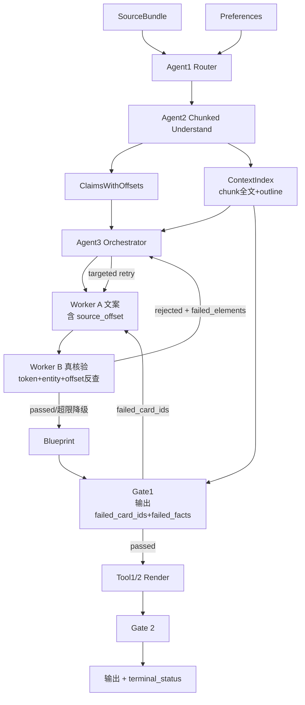

# v3.1.6 修复设计方案

> 制定：架构组
> 日期：2026-04-29
> 上游证据：`DELIVERY_v3.1.5.md`、`evals/reports/RED_TEAM_AUDIT.md`、对 v3.1.5 代码的逐文件审查
> 上一版定性：Pre-alpha（5/18 严重 hallucination、18/18 L2 降级、18/18 平台路由错误）

---

## 0. 设计原则

1. **修事实链路第一，修可观测性第二**：Hallucination 是发布门槛，平台路由 / 降级语义 / 指标都是次级问题，但 Phase 划分上让它们与事实链路并行推进，避免阻塞总进度。
2. **闭环原子化**：IR 字段 / Worker 改造 / 调用方使用 必须在同一个 Sprint 内完成；不允许出现"加了字段没人写"或"Worker 输出了字段但 Orchestrator 不消费"的中间态。
3. **可对照基线**：Phase 0 必须先建 baseline 报表；后续每个 Phase 都对照同一份 baseline 验证成效，避免"修了但说不清修了多少"。
4. **降级是异常路径，不是默认路径**：v3.1.6 验收门禁加 L2 比例 ≤30% 的 CI 限制，逼出工程纪律。
5. **不破坏 v3.1.5 已稳定的能力**：Gate 1/2 编排骨架、LangGraph 状态机、Workers C/D、Tool 1 渲染保持 ABI 兼容；改动仅限事实链路上必须改的 6 个文件。

---

## 1. 与 ChatGPT 5.5 方案的对照

| 议题 | ChatGPT 5.5 | 本方案 | 理由 |
| --- | --- | --- | --- |
| Phase 划分 | Phase 0–7 单串行 | 重组为 4 个 Sprint（基线 / 事实链路 / 路由观测 / 验证） | Phase 1 (IR) 独立成相会出现"改了模型没人用"的死字段；事实链路 5 个改动是原子操作，必须同 Sprint 上线 |
| Phase 0 诊断脚本 | ✅ 3 个脚本 | ✅ 完整保留 | 这是后续验收的对照基线，应当 D-Day -1 完成 |
| IR 改动 | source_offset / chunk_id / verification_error | 同上 + **ContextIndex 完整 Pydantic 模型** + **CacheKey schema 升级** | ChatGPT 没指明 cache key 必须升级，否则升完 evidence 窗口后命中旧缓存 = 没修 |
| Agent 2 真分块 | 真分块 + embedding 合并（P2） | 真分块 + **chunk_id 唯一性去重**为主，embedding 留 P2 | embedding 引依赖会拖进度；先用 (chunk_id, claim 前 30 字) 哈希去重就足够 |
| Worker A 上下文 | evidence 400–600 字 + outline + section summary | **400 字 evidence + 该卡 chunk 完整原文 + outline + fact_elements 列表** | "section summary" 在 v3.1.5 里没人产出；用 chunk 原文更直接 |
| Worker B 真核验 | 数字 token-level + 实体别名 + REJECTED 状态 | 同上 + **RapidFuzz 模糊匹配兜底** + **`source_offset` 反查校验** | 实体别名字典覆盖率不会很高；模糊匹配 + offset 反查可补漏 |
| Agent 3 闭环 | 单卡 A→B 重试 ≤2 次 | 同上 + **明确 text_only 降级卡的内容生成逻辑** | ChatGPT 说"超限降级"但没说降级卡到底写什么 |
| Gate 1 输出 | failed_card_ids + failed_facts | 同上 + **gate1 输入升级为"全文 outline + chunk 全文 + card 内容"** | ChatGPT 提到了但没强调这一点是关键——评分器看到的源信必须比生成器更全 |
| Agent 1 平台 | preferences 入参 + 代码强制覆盖 | 同上 + **修正 prompt 第 47 行的同义规则 bug** | ChatGPT 漏了这条隐藏规则错误 |
| 缓存策略 | 未提 | **新增 §6.4 缓存失效与冷启动成本预算** | 升级 prompt schema 后 Worker A / Agent 2 全量缓存失效，必须做容量规划 |
| 成本影响 | 未提 | **§7 成本评估**：Agent 2 单次 → N 次 LLM，成本预计 ×1.5–2.5 | Sonnet 4 单 case token 已经 ~30k；改后会到 ~50k |
| 测试策略 | 单测 + 回归 + 冒烟 | 同上 + **专门的 hallucination 抽检集 + LLM-as-Judge 自动门禁** | 没有自动门禁就没法持续度量 |

---

## 2. 整体目标流程



关键变化（与 v3.1.5 对比）：
1. ContextIndex 作为 Agent 2 → Worker A/B/Gate 1 的共享数据通道，避免每层各自截断。
2. Worker B 真驳回 → Agent 3 单卡循环（替代 v3.1.5 的"标 DEGRADED 直接放行"）。
3. Gate 1 → Worker A 的回退携带定位信息，避免 Worker A 拿同一份残缺资料反复犯同样错。

---

## 3. 数据结构变更（一次性提交，避免反复改 IR）

> 全部加到 `ir/models.py`。新字段都加默认值，向后兼容 v3.1.5 数据。

### 3.1 SourceOffset / FactElement 升级

```python
class SourceOffset(BaseModel):
    """事实在原文中的字符位置。"""
    chunk_id: str          # 关联到 ContextIndex.chunks[i].chunk_id
    char_start: int        # 原文 chunk 内的起始位置
    char_end: int
    text: str              # 实际抽取的字符串（用于反向校验）

class FactElement(BaseModel):
    text: str
    element_type: Literal["number", "date", "entity", "percentage"]
    context_50: str
    source_offset: SourceOffset | None = None  # 新增，强烈推荐填
    normalized_text: str | None = None          # 新增，归一化后的形式（千分位/百分号统一）
```

### 3.2 Claim 升级

```python
class Claim(BaseModel):
    claim_text: str
    evidence_span: str                          # 保留，向后兼容
    evidence_spans: list[EvidenceSpan] = []     # 已有
    source_refs: list[str]
    disagreement_refs: list[str] = []
    fact_elements: list[FactElement] = []
    importance: float = 0.5
    source_chunk_ids: list[str] = []            # 新增：claim 来自哪些 chunk
```

### 3.3 ContextIndex（全新类型）

```python
class ChunkRef(BaseModel):
    chunk_id: str           # 形如 "c01", "c02"
    char_start: int         # 在原文中的全局起始位置
    char_end: int
    text: str               # chunk 完整原文
    section_title: str | None = None

class ContextIndex(BaseModel):
    """Agent 2 输出，供 Worker A/B 与 Gate 1 共享，
    替代过去到处截断 evidence_span 的零碎做法。"""
    source_id: str
    full_outline: str       # 全文 outline ≤300 字
    chunks: list[ChunkRef]
    chunk_summaries: dict[str, str]  # chunk_id → 该块 ≤80 字摘要

    def get_chunk(self, chunk_id: str) -> ChunkRef | None: ...
    def get_chunks_for_claim(self, claim: Claim) -> list[ChunkRef]: ...
    def slice_around_offset(self, offset: SourceOffset, radius: int = 200) -> str: ...
```

### 3.4 BCheck 升级

```python
class BCheckStatus(str, Enum):
    PASSED = "passed"
    DEGRADED = "degraded"   # 非阻塞降级（次要元素未匹配）
    REJECTED = "rejected"   # 新增：阻塞驳回，要求 Worker A 重写

class VerificationFailure(BaseModel):
    element: str
    element_type: Literal["number", "date", "entity", "percentage"]
    error_type: Literal["not_in_source", "truncated_digits",
                        "year_drift", "entity_swap", "offset_mismatch"]
    card_field: Literal["title", "body", "items", "data_label", "data_desc"]
    source_candidates: list[str] = []  # 原文中可能的正确表达，供 Worker A 参考

class BCheck(BaseModel):
    status: BCheckStatus
    verified_elements: list[str] = []
    failed_elements: list[str] = []          # 保留向后兼容
    failures: list[VerificationFailure] = [] # 新增：结构化失败信息
    retry_count: int = 0                     # 新增：累计重试次数
```

### 3.5 Card 升级

```python
class Card(BaseModel):
    card_index: int
    suggested_type: CardType
    content: CardContent
    visual_spec: VisualSpec
    b_check: BCheck
    claim_refs: list[str] = []
    fact_usages: list[FactElement] = []     # 新增：本卡引用的所有事实
    is_text_only_fallback: bool = False     # 新增：是否是降级卡
```

### 3.6 Gate1 输出升级

```python
class FailedFact(BaseModel):
    card_id: str
    card_field: str
    original_text: str           # 原文中的正确表达
    hallucinated_text: str       # 卡片中的错误表达
    error_summary: str

class Gate1DimScore(BaseModel):
    dimension: str
    score: float
    threshold: float
    passed: bool
    reason: str
    retry_target: str
    failed_card_ids: list[str] = []   # 新增
    failed_facts: list[FailedFact] = []  # 新增（仅 faithfulness 维度填充）
```

### 3.7 终态字段

```python
class TerminalStatus(str, Enum):
    PASSED = "passed"
    BLOCKED = "blocked"
    L1_DEGRADED = "l1_degraded"
    L2_DEGRADED = "l2_degraded"
    L3_DEGRADED = "l3_degraded"

class RenderArtifact(BaseModel):
    # ... 原字段 ...
    terminal_status: TerminalStatus = TerminalStatus.PASSED
    degrade_format: bool = False       # video → image 时为 True
    degrade_reason: str | None = None  # "ffmpeg_missing" 等
```

---

## 4. Sprint 划分（按依赖闭环重组，4 个 Sprint，约 12–15 个工作日）

### Sprint 0：基线脚手架（D-Day −1，0.5 天）

> 必须在动任何代码前完成，否则后续每一步都没法量化对照。

**1. `tools/diagnostic_hallucination.py`**

- 输入：`evals/runs/**/gate1.json`
- 输出 `reports/baseline_hallucination.md`：每个 case 的 faith 分 + reason 关键词分类（"事实改写 / 数字截断 / 年份错位 / 编造 / 实体替换"）+ 严重 (<80) / 中度 (80–89) / 通过 (≥90) 分布。

**2. `tools/diagnostic_capacity.py`**

- 输入：`gate1.json` completeness reason + `blueprint.json` card 数 + `evals/datasets/**/*.txt` 字数
- 输出：每个 case 的"原文章节数 vs Blueprint 卡片数 vs completeness 分"对照表 + 物理覆盖率估算。

**3. `tools/diagnostic_routing.py`**

- 输入：`evals/datasets/**/meta.yaml`（`target_platform`）+ `agent1_router.json`（`platform`）
- 输出：一致率统计 + 各类型文章的偏置方向。

**Sprint 0 验收**：跑出 baseline 三张报表，提交到 `reports/baseline_v3.1.5/`，作为 Sprint 1–3 的对照基准。

---

### Sprint 1：事实链路（5–7 天，原子提交）

> 6 个文件协同改动，必须在同一个 PR / 分支内完成、合并后一次跑通 18 case 回归。**单个文件改完不可单独发布**。

#### 1.1 `ir/models.py`：完成 §3 的全部数据结构升级（0.5 天）

- 加入 SourceOffset / ContextIndex / FailedFact / TerminalStatus / VerificationFailure
- 现有字段保持向后兼容，新字段全部提供默认值
- 跑现有单测确保不 break v3.1.5 已通过的回归

#### 1.2 `agents/agent2_understand.py`：真分块抽取（2 天）

**核心改动**：

```python
@trace("Agent2.Understand")
async def run_agent2_understand(
    source_bundle: SourceBundle,
    router_decision: RouterDecision,
) -> tuple[ContentTree, ContextIndex]:           # ← 返回值升级
    text = source_bundle.text
    chunks = _split_text_chunks(text)             # 旧函数已存在，复用

    # 1. 全文 outline 单次调用
    outline = await _llm_extract_outline(text)

    # 2. 每个 chunk 并行抽 Claim（asyncio.gather + Semaphore=4）
    claims_per_chunk = await asyncio.gather(*[
        _llm_extract_claims_for_chunk(chunk, idx) for idx, chunk in enumerate(chunks)
    ])

    # 3. 跨 chunk 去重（先用 hash 前缀，embedding 留 P2）
    merged_claims = _dedupe_claims(claims_per_chunk)

    # 4. 卡片预算：保留 PRD 上限 15，新增"目录卡"承载未覆盖章节
    budget = _calculate_card_budget(...)

    # 5. 构造 ContextIndex
    context_index = ContextIndex(
        source_id=source_bundle.source_id,
        full_outline=outline,
        chunks=[ChunkRef(chunk_id=f"c{i:02d}", char_start=..., char_end=..., text=chunk)
                for i, chunk in enumerate(chunks)],
        chunk_summaries={...},
    )

    return content_tree, context_index
```

**关键 prompt 升级**（每块 LLM 调用）：

```
你是内容分析师。下面是文章的第 {chunk_id} 段（共 {total_chunks} 段，第 {char_start}-{char_end} 字）：

[chunk 完整原文]

抽取本段的核心 Claim 和精确事实元素。要求：
1. 每个 fact_element 必须给出 source_offset = [start, end]，对应原文位置（**chunk 内偏移**）
2. 数字必须逐字搬运，禁止改写位数和单位
3. 年份必须从原文 token 直接抽取，禁止默认推断
4. 输出 JSON Schema：{...}
```

#### 1.3 `workers/worker_a_copy.py`：上下文金字塔 + retry payload（1.5 天）

**输入升级**：

```python
def run_worker_a(
    slot: dict,
    content_tree: ContentTree,
    context_index: ContextIndex,        # 新增
    router_decision: RouterDecision,
    slot_index: int,
    claim: Claim | None = None,
    retry_payload: RetryPayload | None = None,  # 新增
) -> CardContent:
    ...
```

**Prompt 模板**（prompt 全文已加到 `workers/prompts/worker_a_v316.py`，下面是关键段）：

```
[全文 outline] (≤300 字)
{context_index.full_outline}

[本卡对应章节摘要]
{context_index.chunk_summaries[claim.source_chunk_ids[0]]}

[本卡核心 Claim]
{claim.claim_text}

[原文证据片段（≤500 字）]
{context_index.slice_around_offset(claim.fact_elements[0].source_offset, radius=200)}

[本卡必须忠实搬运的事实元素]
- 数字: {fact_numbers}
- 日期: {fact_dates}
- 实体: {fact_entities}

输出 JSON：
{{
  "title": ..., "body": ..., "items": [...],
  "fact_usages": [
    {{"text": "...", "element_type": "number", "source_offset": {{...}}}}
  ]
}}

硬约束：
1. body 中出现的每个数字、日期、实体必须出现在上面"事实元素"列表中
2. fact_usages 必须列出 body 引用的所有事实及其 source_offset
3. 禁止生成上面"原文证据"中没有的实体名/数字
{retry_block}  ← 当 retry_payload 非空时插入"上一次错误是 X，请改为 Y"
```

**retry_payload 处理**：

```python
class RetryPayload(BaseModel):
    failed_card_id: str
    failed_facts: list[FailedFact]
    error_summary: str

# 当 retry_payload 非空时，prompt 末尾插入：
# "[上次重写错误]
#  card_field=body 中将 '{hallucinated}' 错写，原文是 '{original}'，
#  本次必须改正。"
```

**缓存 key 升级**（避免命中 v3.1.5 旧缓存）：

```python
cache_key = hashlib.sha256(
    f"v316|{claim.claim_text}|{user_type}|{evidence_text}|{outline}|{retry_count}".encode()
).hexdigest()
```

#### 1.4 `workers/worker_b_factcheck.py`：真门禁（1.5 天）

**核心改动**：

```python
def run_worker_b(
    card_content: CardContent,
    fact_usages: list[FactElement],   # 新增：来自 worker A 的事实声明
    context_index: ContextIndex,       # 新增：原文索引
    source_text: str,
    claim: Claim | None = None,
) -> BCheck:
    failures = []

    # 1. 数字 token-level 校验
    for num in _extract_numbers_with_position(card_content.body + card_content.title):
        if not _verify_number_in_source(num, context_index):
            failures.append(VerificationFailure(
                element=num, element_type="number",
                error_type="truncated_digits" if len(num) >= 4 else "not_in_source",
                card_field="body",
                source_candidates=_find_similar_numbers(num, context_index),
            ))

    # 2. 日期校验：YYYY 必须逐字出现在原文 chunk 中（防 2025→2024 错位）
    for date in _extract_dates(card_content.body):
        if date not in source_text:
            failures.append(VerificationFailure(
                element=date, element_type="date", error_type="year_drift", ...
            ))

    # 3. 实体校验：spaCy 抽实体 → 精确匹配 → alias 匹配 → RapidFuzz 模糊兜底
    for entity in _extract_entities_via_spacy(card_content.body):
        if not _verify_entity(entity, context_index, alias_table, fuzzy_threshold=85):
            failures.append(VerificationFailure(
                element=entity, element_type="entity", error_type="entity_swap", ...
            ))

    # 4. fact_usages 反查：worker A 声明的 source_offset 必须真能定位到原文
    for fact in fact_usages:
        if fact.source_offset and not _verify_offset(fact, context_index):
            failures.append(VerificationFailure(
                element=fact.text, element_type=fact.element_type,
                error_type="offset_mismatch", ...
            ))

    # 5. 状态判定
    if not failures:
        return BCheck(status=PASSED, ...)

    # 严重失败：≥1 个 truncated_digits / year_drift / entity_swap → REJECTED
    severe = [f for f in failures if f.error_type in
              ("truncated_digits", "year_drift", "entity_swap")]
    if severe:
        return BCheck(status=REJECTED, failures=failures, ...)

    # 仅 not_in_source 类小问题 → DEGRADED
    return BCheck(status=DEGRADED, failures=failures, ...)
```

**spaCy 依赖**：
- `pip install spacy && python -m spacy download zh_core_web_sm`（先用 sm，trf 留 P2）
- 进程内常驻，NER 单卡 < 50ms
- 加载失败时降级为正则实体抽取（中文人名/地名常见后缀模式）+ alias 字典

**RapidFuzz 兜底**：
- `from rapidfuzz import fuzz; fuzz.ratio(entity, candidate)`
- ≥85 视为匹配（如"国家发改委 vs 发改委" ratio=88）
- 防止 alias 字典维护不全导致系统性误报

#### 1.5 `agents/agent3_orchestrate.py`：单卡 A→B 闭环（1 天）

```python
async def _orchestrate_card(slot, claim, content_tree, ctx_idx, router_decision, slot_idx) -> Card:
    """每张卡的 A→B 重试循环，最多 2 次，超限降级 text_only。"""
    retry_payload = None
    last_b_check = None
    for attempt in range(MAX_CARD_RETRIES):  # = 2
        content = await run_worker_a_async(
            slot, content_tree, ctx_idx, router_decision, slot_idx, claim, retry_payload
        )
        b_check = await loop.run_in_executor(None, lambda:
            run_worker_b(content, content.fact_usages, ctx_idx, source_text, claim))

        if b_check.status != BCheckStatus.REJECTED:
            return _build_card(slot, content, b_check, attempt)

        # 准备 retry payload
        retry_payload = _build_retry_payload(b_check.failures, content)
        last_b_check = b_check

    # 超限：降级 text_only 卡
    fallback_content = _build_text_only_fallback(claim, ctx_idx)  # 直接抽 chunk 摘要 + claim text，不再调 LLM
    return _build_card(slot, fallback_content, last_b_check.model_copy(
        update={"status": BCheckStatus.DEGRADED}), attempt + 1, is_text_only_fallback=True)
```

**text_only 降级逻辑**（重要，ChatGPT 漏了这部分）：

```python
def _build_text_only_fallback(claim, ctx_idx):
    """超限降级：直接从 chunk 摘要构造文案，不再请求 LLM。"""
    chunk = ctx_idx.get_chunks_for_claim(claim)[0] if claim.source_chunk_ids else None
    summary = ctx_idx.chunk_summaries.get(chunk.chunk_id, "") if chunk else ""
    return CardContent(
        title=(claim.claim_text[:18]),
        body=(summary[:80] or claim.claim_text[:80]),
        items=[], data_label="", data_desc="", timeline_time="",
        title_warning=False,
        fact_usages=[],  # 不声明任何事实，避免再被 Worker B 拒
    )
```

#### 1.6 `gates/gate1_blueprint.py`：定位输出 + 升级 faithfulness 输入（1 天）

**Faithfulness prompt 升级**：

```python
_FAITHFULNESS_PROMPT_V316 = """你是事实准确性评估专家。请评估信息图卡片是否忠实于原文。

【全文 outline】
{outline}

【每张卡对应的原文 chunk 完整内容】
{cards_with_full_chunks}    # 不再只给 evidence_span，给 chunk 全文

【信息图卡片内容】
{card_contents_with_ids}    # 必须带 card_id，方便定位

输出 JSON：
{{
  "score": 0-100 的整数,
  "reason": "整体评估理由（≤80字）",
  "failed_card_ids": ["card_001", ...],
  "failed_facts": [
    {{
      "card_id": "card_001",
      "card_field": "body",
      "original_text": "原文中的正确表达",
      "hallucinated_text": "卡片中的错误表达",
      "error_summary": "数字截断 / 年份错位 / 实体替换 / 编造"
    }}
  ]
}}
"""
```

**LangGraph 路由调整**（`orchestrator/graph.py`）：

```python
# faithfulness 失败时，不再粗暴回 worker_a，而是在节点内构造 retry_payloads
# 给 Agent 3 的局部重试入口
def node_after_gate1_fail(state):
    g1 = state["gate1_result"]
    faith_dim = next((d for d in g1.dim_scores if d.dimension == "faithfulness"), None)
    if faith_dim and faith_dim.failed_card_ids:
        # 局部重写：只对 failed_card_ids 调 Worker A，复用其他卡
        return {**state, "retry_payloads": _build_payloads_from_failed_facts(faith_dim)}
    # 其他维度失败走原回退路径
    ...
```

#### Sprint 1 验收

- 18 case 回归：severe hallucination (faith<80) 比例 **≤10%**（v3.1.5 是 28%）
- `comp_R02 / R03 / R05 / func_07 / edge_26` 这 5 条已知严重 case：至少 4 条 faith ≥80
- `comp_R02` completeness ≥85（解决 Agent 2 中段丢失）
- 物理覆盖率 ≥80%（diagnostic_capacity.py）
- v3.1.5 通过的所有单测（61 passed）继续通过

---

### Sprint 2：路由 + 可观测性（2–3 天，并行）

> 与 Sprint 1 可在不同分支并行；合并前先合 Sprint 1，再 rebase。

#### 2.1 `agents/agent1_router.py`：preferences 强约束 + prompt 修正（0.5 天）

```python
@trace("Agent1.Router")
def run_agent1_router(
    source_bundle: SourceBundle,
    preferences: Preferences | None = None,    # 新增
) -> RouterDecision:
    decision = _llm_route(source_bundle)        # 走原 LLM
    # 强制覆盖：用户偏好优先级最高
    if preferences:
        if preferences.target_platform and preferences.target_platform != "auto":
            decision = decision.model_copy(update={"platform": preferences.target_platform})
        if preferences.style_hint and preferences.style_hint != "auto":
            decision = decision.model_copy(update={"style_hint": preferences.style_hint})
    return decision
```

并修正 prompt 第 47 行：

```
- platform：娱乐/生活/种草 → xiaohongshu；严肃资讯/商业 → wechat_moments；不确定 → xiaohongshu（默认）
```

#### 2.2 `orchestrator/graph.py`：Pipeline 接 preferences（0.5 天）

PipelineState 加 `preferences: Preferences | None`；`node_agent1` 把 preferences 传给 router。

#### 2.3 终态语义清晰化（0.5 天）

- `RenderArtifact.terminal_status` 字段实装
- video → PNG 降级时设 `degrade_format=True, degrade_reason="ffmpeg_missing"`
- BLOCKED case 的 `summary.csv` `terminal_status` 改为 `blocked`（不再是 `passed`）

#### 2.4 Metrics 接入（1 天）

补全 `infra/metrics.py`：

```python
gate1_pass_rate = Gauge("gate1_pass_rate", "Gate1 各维度通过率", ["dimension"])
gate2_l0_pass_rate = Gauge("gate2_l0_pass_rate", "Gate2 L0 通过率")
degradation_total = Counter("degradation_total", "降级总数", ["level"])
worker_b_rejection_total = Counter("worker_b_rejection_total", "Worker B 驳回次数",
                                    ["error_type"])
worker_a_retry_total = Counter("worker_a_retry_total", "Worker A 单卡重试次数")
hallucination_severity = Histogram("hallucination_severity",
                                    "faithfulness 评分分布",
                                    buckets=[60, 70, 80, 85, 90, 95, 100])
```

CI 门禁：评估 run 完成后读 metrics，若 `degradation_total{level=L2} / total_jobs > 0.30` 则 fail。

#### 2.5 边缘 case 补齐（0.5 天）

- 补 `evals/datasets/edge/edge_12_sensitive_political/`（敏感政治）和 `edge_15_multi_conflict_data/`（多源冲突）的 .txt + .meta.yaml
- 修 `tests/eval/assertions.py` 在 L2 路径下不对 blueprint 做非空断言

---

### Sprint 3：测试 + 验证（2–3 天，依赖 Sprint 1+2 合并）

#### 3.1 单元测试矩阵

| 文件 | 测试 |
| --- | --- |
| `tests/unit/test_agent1_preferences.py` | preferences.target_platform 必须强制覆盖 LLM 决策 |
| `tests/unit/test_agent2_chunked.py` | 8000+ 字必须真分块；chunk_id 唯一；ContextIndex 包含全文 |
| `tests/unit/test_worker_a_retry.py` | retry_payload 非空时，prompt 必须包含 wrong/correct evidence |
| `tests/unit/test_worker_b_severe.py` | 数字截断 / 年份错位 / 实体替换三类必须 REJECTED；alias 命中视为 PASSED；模糊匹配 ≥85 算命中 |
| `tests/unit/test_agent3_card_loop.py` | 单卡重试 ≤2 次；超限走 text_only；is_text_only_fallback=True |
| `tests/unit/test_gate1_failed_facts.py` | faithfulness <90 时必须填 failed_card_ids 与 failed_facts |
| `tests/unit/test_terminal_status.py` | BLOCKED → terminal_status=blocked；video 缺 ffmpeg → l1_degraded + degrade_format=True |

#### 3.2 集成测试

- `tests/integration/test_pipeline_v316.py`：跑 5 个固定 case，断言 faith ≥85 比例、completeness ≥85 比例、平台一致率 100%、L2 比例 ≤30%
- `tests/integration/test_retry_loop.py`：构造一条已知会触发 Worker B REJECTED 的 case，断言 Agent 3 重试 1 次后 PASSED

#### 3.3 LLM-as-Judge 抽检（自动门禁）

新增 `tests/eval/run_hallucination.py`：

- 跑全部 18 case
- 用独立 LLM（不同模型，避免同源 bias）对每张卡做事实匹配评分
- 输出 `severity_distribution.json`
- CI 门禁：`severe_count / total_cards > 5%` 则 fail

#### 3.4 完整回归

跑 `tests/eval/run_comprehensive.py` + `run_functional.py` + `run_edge.py`，对照 Sprint 0 baseline 三张报表，输出 v3.1.6 final report。

---

## 5. 实施时序与依赖

```
D-Day -1:    Sprint 0（baseline 脚手架）          ▓ 0.5d
D-Day  1-7:  Sprint 1（事实链路 6 个文件原子改动）  ▓▓▓▓▓▓▓ 5-7d
              ├─ ir/models.py                    ▓ 0.5d
              ├─ agents/agent2_understand.py     ▓▓ 2d   ─┐
              ├─ workers/worker_a_copy.py        ▓▓ 1.5d  │ 串行（A 依赖 ctx_idx）
              ├─ workers/worker_b_factcheck.py   ▓▓ 1.5d  │ 串行（B 验 A 输出）
              ├─ agents/agent3_orchestrate.py    ▓ 1d    ─┘
              └─ gates/gate1_blueprint.py        ▓ 1d   并行（依赖 IR）
D-Day  4-6:  Sprint 2（路由+观测）                ▓▓▓ 2-3d  与 Sprint 1 后半段并行
D-Day  8-10: Sprint 3（测试+验证）                ▓▓▓ 2-3d  依赖 1+2 合并
———————————————————————————————————————————————————————
总计：约 10-13 个工作日（不含 review/合并 buffer）
```

**关键依赖**：
- Sprint 1 必须先合 IR 改动（1.1），再合各 Worker（不能反过来）
- Sprint 1 全部合并前不允许 Sprint 3 跑回归（数据不可比）
- Sprint 2 的 Agent1 preferences 依赖 IR 中 `Preferences` 类型，但该类型 v3.1.5 已存在，可独立推进

---

## 6. 关键工程细节

### 6.1 Source offset 反查机制

LLM 输出的 `source_offset = [start, end]` 不能盲信。Worker B 必须做：

```python
def _verify_offset(fact: FactElement, ctx_idx: ContextIndex) -> bool:
    if not fact.source_offset:
        return False
    chunk = ctx_idx.get_chunk(fact.source_offset.chunk_id)
    if not chunk:
        return False
    actual = chunk.text[fact.source_offset.char_start:fact.source_offset.char_end]
    # 完全匹配
    if actual == fact.text:
        return True
    # 归一化匹配（去千分位、统一百分号）
    if _normalize(actual) == _normalize(fact.text):
        return True
    # 模糊兜底（容忍 1-2 个字符误差，阈值 ≥90）
    return fuzz.ratio(actual, fact.text) >= 90
```

### 6.2 Agent 2 跨 chunk Claim 去重（不引入 embedding）

```python
def _dedupe_claims(claims_per_chunk: list[list[Claim]]) -> list[Claim]:
    seen: dict[str, Claim] = {}  # key = claim_text 前 30 字 hash
    for chunk_claims in claims_per_chunk:
        for c in chunk_claims:
            key = hashlib.sha256(c.claim_text[:30].encode()).hexdigest()[:8]
            if key in seen:
                # 重复，importance 取大者，source_chunk_ids 累加
                existing = seen[key]
                seen[key] = existing.model_copy(update={
                    "importance": max(existing.importance, c.importance),
                    "source_chunk_ids": list(set(existing.source_chunk_ids + c.source_chunk_ids)),
                })
            else:
                seen[key] = c
    return sorted(seen.values(), key=lambda c: -c.importance)
```

embedding 合并作为 P2，等到 chunk 数 ≥10 的场景再考虑。

### 6.3 Worker B 实体抽取的渐进策略

```
第一选择：spaCy zh_core_web_sm（轻量，~30MB，CPU 推理 < 50ms）
失败回退 1：正则模板（中文姓名 / 地名后缀 / 机构后缀）+ 已抽取的 fact_usages
失败回退 2：跳过实体校验，仅校验数字 + 日期（保底不阻塞）
日志：每次回退都打 warning
```

### 6.4 缓存失效与冷启动成本预算

升级后必须废弃旧 cache：

```python
CACHE_VERSION = "v316"
cache_key = f"{CACHE_VERSION}|{...}"
```

**冷启动成本估算**（按 v3.1.5 18 case 的 token 量估算）：

| 项 | v3.1.5 | v3.1.6 | 增量 |
| --- | --- | --- | --- |
| Agent 2 LLM 调用次数 | 1 次/case | 1+N 次（N=chunk 数，平均 2–3） | ×2.5 |
| Agent 2 token in | ~8000 | ~12000（chunk 全文 + outline） | ×1.5 |
| Worker A token in | ~600 | ~1500（金字塔上下文） | ×2.5 |
| Worker A 重试 | 0 次 | 平均 0.3 次（30% 卡触发） | +30% |
| Gate 1 token in | ~25k × 4 维 | ~30k × 4 维 | ×1.2 |
| **单 case Sonnet token** | **~30k** | **~50k** | **×1.67** |
| **单 case 耗时** | **~110s** | **预估 ~140-160s** | **×1.3-1.5** |

→ 18 case 全跑成本预计 ×1.7，时长 ×1.4。可接受。

### 6.5 风险登记表

| 风险 | 概率 | 影响 | 缓解 |
| --- | --- | --- | --- |
| spaCy 加载在 CI 环境失败 | 中 | Worker B 实体校验降级 | 准备 ZH_NAME/ZH_ORG/ZH_LOC 正则表 + alias 字典作为 NER 备份 |
| LLM 输出 source_offset 不准（数字偏差几位） | 高 | Worker B 误拒 | 反查时允许 ±5 字符容忍 + 模糊匹配 ≥90 |
| Agent 2 真分块成本上涨触发限流 | 中 | 端到端耗时 ×2 | Sonnet 8 RPS 限流不变；分块并行 Semaphore=4，避免突发 |
| ContextIndex 序列化体积大（chunk 全文 ×N） | 低 | PG 表膨胀 | 落 PG 时只存指针，原文存 MinIO；ContextIndex 内只持 chunk_id + char_range |
| 真分块后 Claim 总数膨胀，超出 budget 上限 | 中 | 信息丢失感强 | 加"目录卡 / 遗漏章节卡"承载未覆盖章节；保留 PRD 15 张上限 |
| Worker A 重写 ≥2 次仍 REJECTED 时 text_only 卡片质量低 | 中 | 用户感知差 | text_only 卡内容直接来自 chunk 摘要（已经是高质量抽取），不会更差；标 is_text_only_fallback 让前端可以特殊标识 |

---

## 7. 验收门禁（Sprint 3 最终）

| 指标 | v3.1.5 baseline | v3.1.6 验收门禁 |
| --- | --- | --- |
| Faithfulness severe (<80) 占比 | 28% (5/18) | **≤10%** |
| Faithfulness 平均分 | ~78 | **≥85** |
| Completeness 平均分 | 67 | **≥80** |
| 平台路由一致率 | ~10% | **100%**（强约束 override） |
| L2 降级占比 | 100% (18/18) | **≤30%** |
| `comp_R02 / R03 / R05 / func_07 / edge_26` 5 条严重 case | 5/5 fail | **≥4/5 通过 Gate 1** |
| 单 case 端到端耗时 P50 | 108s | **≤180s** |
| Worker B REJECTED 率 | 0% | **≥15%**（说明 Worker B 真在工作） |
| 单测通过 | 61 passed | **新增 ~25 项，全部通过** |
| LLM-as-Judge severe 比例 | n/a | **≤5%** |

> 任何一项不达标 → v3.1.6 不可发布；继续 Sprint 4 修补。

---

## 8. v3.1.7+ 留白事项

不在 v3.1.6 范围内、但已识别的工作项，明确推到下一版避免范围蔓延：

1. Worker C 接入 lucide / iconify 图标库（视觉质量提升）
2. Worker A/B/C/D 全并行化（性能优化）
3. embedding-based Claim 合并（替代当前 hash 前缀）
4. spaCy 升级 trf 模型（NER 准确率提升）
5. PostgreSQL / Redis / MinIO 接入（基础设施完整化）
6. SSE 流式状态 API（tech_design §2.1.2）
7. Voting 模式（Gate 1 多次评估）
8. 端到端视频路径验证（需 ffmpeg 环境）

---

## 9. 一句话总结

> **v3.1.6 = 重建可追溯事实链路 + 修平台路由 bug + 把降级从默认路径推回异常路径。**
>
> 6 个文件 1 个 Sprint 内原子提交，3 个诊断脚本做对照，Worker B 真驳回是核心 KPI。
